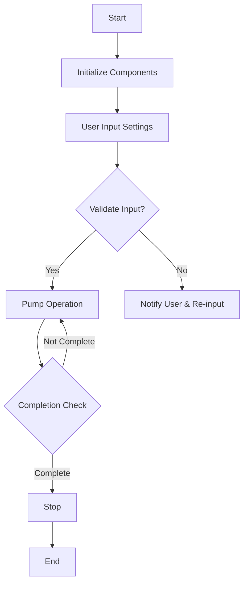

# Syringe Pump Project

## Introduction  
This project focuses on designing and implementing a **syringe pump**. The syringe pump is an essential medical device used for accurate and controlled delivery of fluids, medications, or nutrients into a patient's body. Our project aims to create a cost-effective, reliable, and user-friendly syringe pump suitable for various medical and laboratory applications.

**Created by:** Nguyen Phuc Chi Long  

---

## Project Details  

### Components Used  
| Material            | Quantity (or Weight) | Unit Price (USD) | Total Price (USD) |
|---------------------|----------------------|------------------|-------------------|
| Microcontroller     | TBD                  | TBD              | TBD               |
| Stepper Motor       | TBD                  | TBD              | TBD               |
| Motor Driver        | TBD                  | TBD              | TBD               |
| Sensors             | TBD                  | TBD              | TBD               |
| LCD (optional)      | TBD                  | TBD              | TBD               |
| Plastic Enclosure   | TBD                  | TBD              | TBD               |
| Miscellaneous (e.g., wires, connectors) | TBD | TBD | TBD |

**Note:** TBD = To Be Determined  

---

## Flow Chart  

